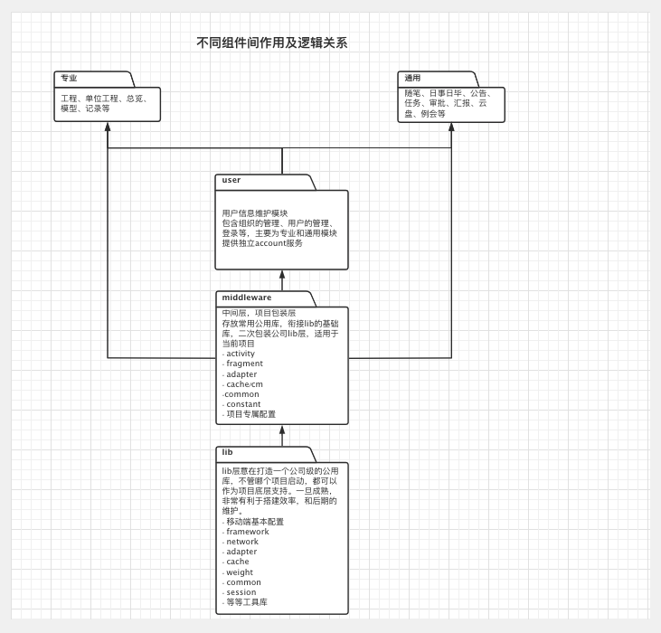
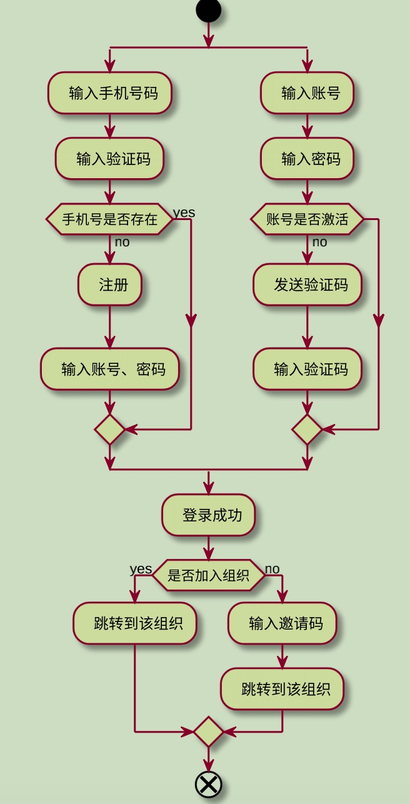

## PMS Android移动端

### 更换组件化开发 2020-04-16



 1. pms作为主模块，依赖其他所有模块，其他模块在运行时为library.
 2. 其他模块，主要依赖middleware，而对应公用性的代码，放到middleware模块下。
 3. middleware顾名思义，作为中间件形式，存放公用性、又非底层的代码，比如登录模块的信息缓存，可能被其他模块用到，就可以放到这一层，其他模块依赖后，便能调用
 4. 组件间调用和通信使用ARouter
 5. 网络部分依然采用 OKHttp + Retrofit + RxJava
 6. 缓存更换为MMKV
 7. Cookie有专门处理模块CookieProvider
 8. RxJava暂未绑定生命周期, 短期内使用独立IO线程池来优化内存泄漏问题
 9. 在lib中对Activity、Fragment、Adapter做了简短封装，二次调整可以在middleware模块进行重写处理
 10. AndroidManifest合并问题，可以在独立模块开发时自行配置
 11. Application全局统一，PMSApplication ——> BaseApplication
 12. 关于依赖问题，共同性的使用'api'，在dependencies.gradle统一配置
 13. 关于资源文件冲突问题，暂时在资源文件前在上module名，考虑到公用性的可以放到middleware中，后期会把Resources单独Module
 14. 主要业务模块在pms中实现，也是MainModule
 15. 网络请求包装体DuobangResponse<>,请求成功onNext()中处理code="success/failure"，请求失败需要在onError()中通过HttpExceptionUtils处理，code值使用ResponseCode类
 16. lib中有utils的使用，先熟悉所有util
 17. 务必熟悉注释语法，规范添加注释。
 18. 使用@SingleClick防止多次点击

### MODULE包结构

    ```
    |—— core 
    |   |—— 功能包
    |   |   |—— imp     // 网络请求，数据实现类
    |   |   |—— parser   // 数据处理
    |   |   |—— bean类  
    |—— i 
    |   |—— 功能包        // api \ 监听接口
    |—— 功能包
    |   |—— contract     // IView \ IPresenter
    |   |—— presenter    // 存放该功能的逻辑类，及其辅助类
    |   |—— view         // view
    |—— base
    |—— common           // 包含自定义view，及Helper
    |—— environment      // 环境配置 config
    |—— framework        // 主页面，基础结构
    |—— cache            // 缓存类
    |—— utils            // 工具类
    ```


 *这是最初的结构，目的方便查看代码，在代码编写阶段，可以酌情处理*

### 代码模式

- 采用简单化的MVP模式，view + presenter + model
- 每个部分对应一个接口，意在声明该部分的主要功能
    - IView继承IBaseView, View继承BaseActivity<P,V>，实现IView
    - Presenter继承BasePresenter<V>，实现IPresenter
    - model部分依然采用单利模式的NetWork处理数据

### 代码规范

- activity继承BaseActivity
- fragment继承BaseFragment
- 页面主题使用DuobangTheme，toolbar采用include的方式加入
- 结构明确，提高代码可读性
- 对Duobang类文件和Base类文件二次封装在middleware实现
- 在代码提交前需要格式化一下，和Reformat Code一下。前提是在不影响代码结构前提下，类中使用build链式结构需要注意。
- ···
《待完善》

### 开发手册
(阿里Android开发手册)[https://github.com/KyneMaster/githubProject]

### 配置
1. Gradle配置
    - 在dependencies.gradle中统一配置
    - 公用性的依赖，可以使用api

### 业务流程

1. 登录


2. 权限
    - 管理员
        - 有默认项目，隐藏工程模块
        - 可以在个人中心切换项目
    - 操作员
        - 默认项目
        - 不能切换
    - 无权限
        - 空白页面
        - 输入邀请码

3. 主结构
    - 消息、概览、工程、工作台、联系人
    - 个人中心测滑

### 开发文档
1. 接口文档遵循Swagger，包括接口测试、数据格式等
2. 开发计划文档 《幕布》https://mubu.com/doc/4GobonPD2G7
3. 开发逻辑文档 暂时添加到README.md
